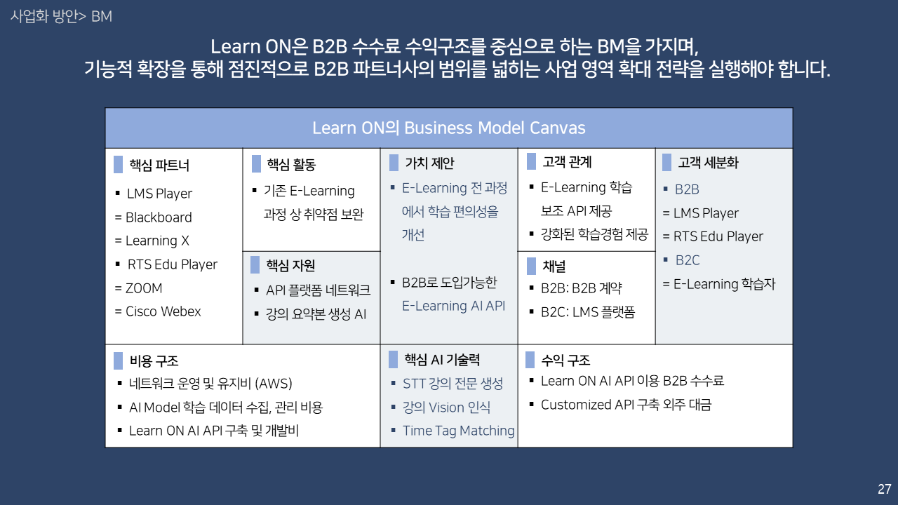
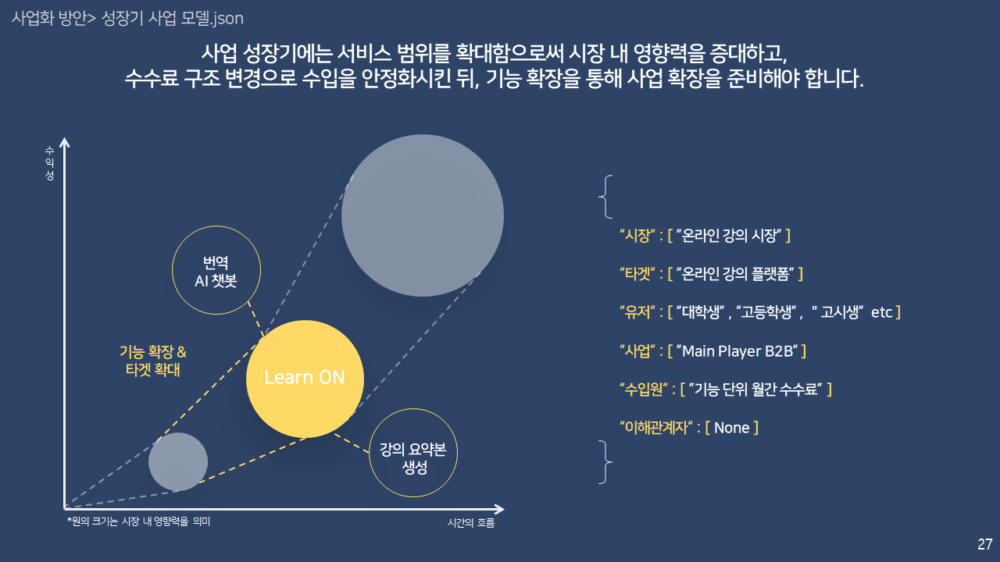
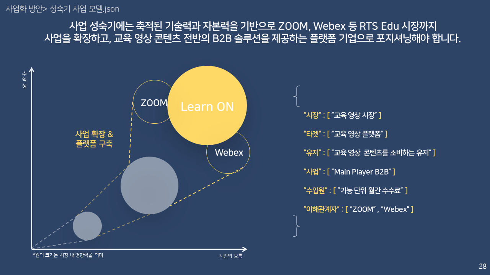

Learn_ON_ver.2
==========
AI-based online re-education assistent
 

<h3> 1. R&R </h3>

|  
Name
 |  
Major
 |  
Role
 |
|:--------|:--------:|--------:|
|**bob.siunn** | 
BA & CS 
 |Data selection and engineering |
|**Yongwook Lee** | 
CS 
 |UIUX design and front end developer |
|**Lee Jeong Min** | 
BA & CS 
 |Server deployment and link |
|**skyriver228** | 
Biomedical Convergence Engineering 
 | ML Modeling |
|**Sarah Son** | 
BA 
 | Data collecting and documentation |

<h3> 2. Introduction </h3>

Learn ON is a AI-based online re-edcation assistent which can overcome online learner's pain point on E-learning process and maximaize the advantages of online learning. As a result, we provide a new paradigm for E-learning.  
  
  
  
* Vision  
: Learn ON aims to improve the inconvenience and inefficiency of online learning in the face of inevitable online learning with Corona 19, and maximize the advantages and convenience of online learning alone, unlike offline learning.  

* Background  
    * Since Covid 19, most offline lectures have moved to online platforms due to social distancing.
    * As a result, the online learning market has experienced unprecedented growth, and this trend is expected to continue even after the end of the Korona 19 crisis.
    * The reason why online learning is so welcomed by learners is that learners can listen to lectures at any time, watch videos again, and re-learn at any time they want.
    * However, there are some unresolved pain points in current online learning.
    * When they have questions while they are in the process of learning, they have to wait a lot of time to get answers, and they do not know at what point they want to check again during the re-learning, which takes inefficient exploration time.  
  
* Why AI?
    * By introducing ai to analyze lecture videos, you can check the overall course flow without having to check the contents of each person.
    * By introducing NLP and STT models in open source or api form to handle online lecture videos that are subject to the service, we can efficiently deliver the desired utility to users.
    * Online lecture video data is expected to perform well in NLP as the flow of lectures is consistent and specific terms act as an index of the flow of lectures and simultaneously separate contexts.
    * In addition, due to the nature of data for information delivery, the quality of STT results is good because of the accurate pronunciation.
  
* Service Feature
    * Auto Bookmark Generator  
    : Automatic bookmark generation function that analyzes the course content and generates bookmarks for key keywords
    * Q&A AI Chatbot  
    : The ability to text the content of a class when you click on the key keyword that makes up the course content.

* Expected Effect
    * Learners can re-learn more effectively through Learn ON.  
    * At any time, you can selectively find and relearn only the necessary parts of the long lecture video, and you can search for the timeline of the parts you need through keyword input.  
    * By storing the desired parts, the efficiency of relearning them several times can be greatly expected.  
    * Because AI assistant can be learned through questions without burden, it can greatly complements the lack of interactions between professors and learners online. 
  
<h4> 2. Business </h4>

Learn ON has a BM centered on the B2B fee revenue structure and must implement a business expansion strategy that gradually expands the scope of B2B partners through functional expansion.    
  
  
  
  
  
